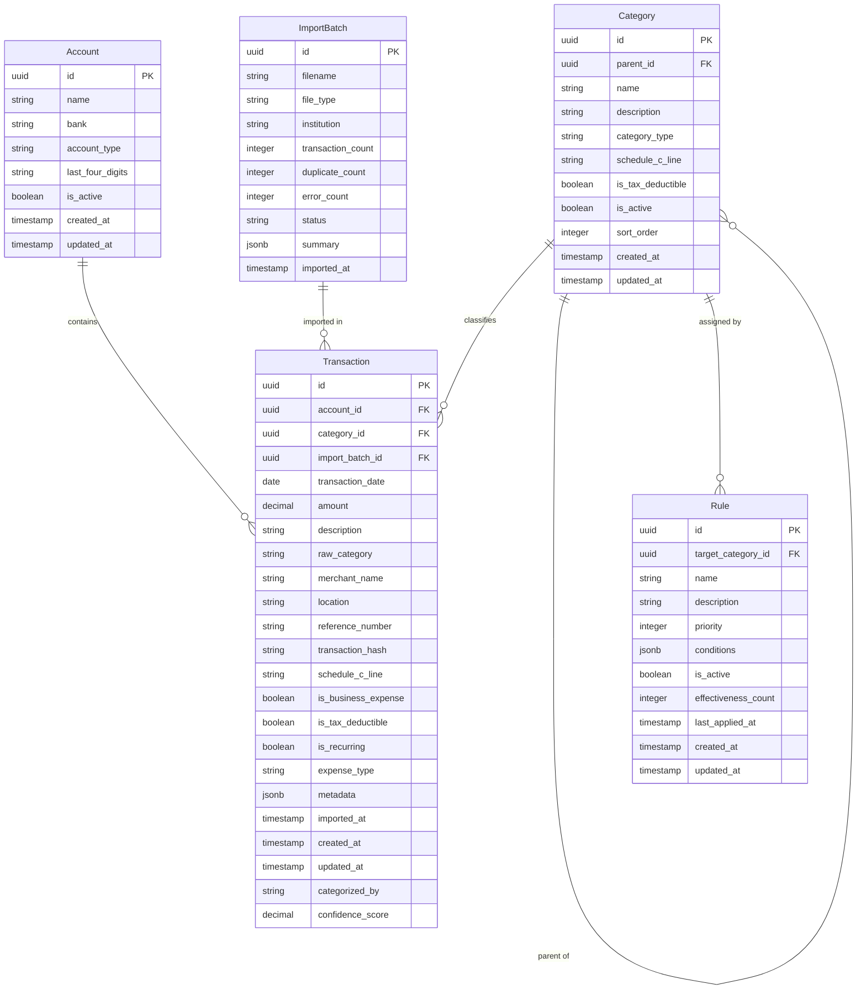
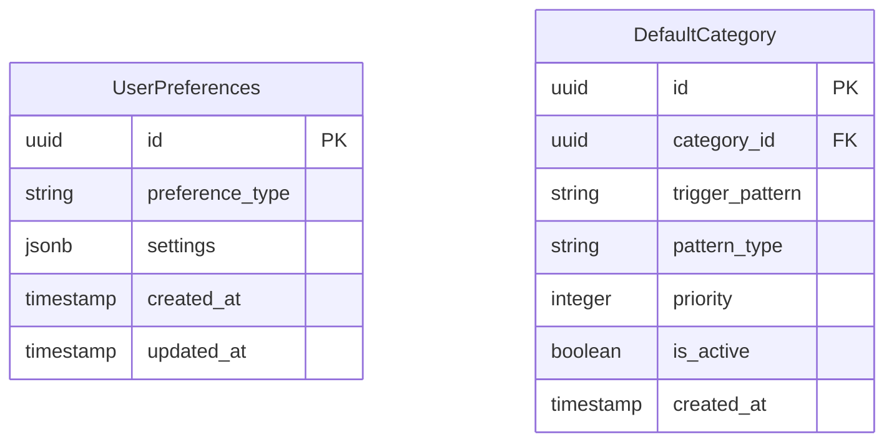

# Data Architecture: Privacy-First Personal Finance CLI

## CPA CONSULTATION REQUEST

Before finalizing the transaction schema, I need input from the Consulting CPA on tax-related fields:

**Tax Field Requirements**:
1. What additional transaction fields are needed to complete Schedule C with high confidence?
2. Are there specific expense categories required by IRS guidelines that should be built into the schema?
3. What fields are needed for home office deduction calculations?
4. What vehicle/mileage expense tracking fields should be captured?
5. Are there any state-specific tax considerations that affect field requirements?
6. What depreciation tracking fields are needed for Section 179 deductions?

**Current proposed tax fields**:
- `schedule_c_line`: Maps to specific Schedule C line items
- `is_business_expense`: Boolean flag for business vs personal
- `is_tax_deductible`: Boolean flag for deductible expenses
- `expense_type`: Enum for common business expense types

Please advise on additions or modifications before I finalize the schema design.

---

# Entity-Relationship Diagrams

## Finance CLI: Core Data Model



## Finance CLI: User Preferences



---

# Data Dictionary

## Entity: Transaction

**Purpose**: Stores individual financial transactions imported from bank exports or manually entered

**Lifecycle**: 
- Created: During import from CSV/QFX or manual entry
- Updated: When recategorized, edited, or enriched with metadata
- Deleted: Rarely (user-initiated cleanup or data correction)

**Volume**: 10,000+ rows per year typical for small business

### Fields

#### Identifiers

| Field | Type | Constraints | Description | Example |
|-------|------|-------------|-------------|---------|
| id | UUID | PK, NOT NULL | Unique transaction identifier | `550e8400-e29b-41d4-a716-446655440000` |
| account_id | UUID | FK, NOT NULL | Reference to Account entity | `660e8400-e29b-41d4-a716-446655440001` |
| category_id | UUID | FK, NULL | Reference to Category entity | `770e8400-e29b-41d4-a716-446655440002` |
| import_batch_id | UUID | FK, NULL | Reference to ImportBatch entity | `880e8400-e29b-41d4-a716-446655440003` |

#### Core Transaction Data

| Field | Type | Constraints | Description | Example |
|-------|------|-------------|-------------|---------|
| transaction_date | DATE | NOT NULL | Date the transaction occurred | `2024-03-15` |
| amount | DECIMAL(12,2) | NOT NULL | Amount (negative=expense, positive=income) | `-49.99` |
| description | VARCHAR(500) | NOT NULL | Original transaction description from bank | `AMAZON.COM*1A2B3C4D AMZN.COM/BILL WA` |
| raw_category | VARCHAR(100) | NULL | Original category from bank export | `Shopping` |
| merchant_name | VARCHAR(200) | NULL | Extracted or cleaned merchant name | `Amazon.com` |
| location | VARCHAR(200) | NULL | Transaction location if available | `Seattle, WA` |
| reference_number | VARCHAR(100) | NULL | Bank reference or confirmation number | `REF123456789` |
| transaction_hash | VARCHAR(64) | NOT NULL, UNIQUE | SHA-256 hash for duplicate detection | `abc123...` |

#### Tax and Business Classification

| Field | Type | Constraints | Description | Example |
|-------|------|-------------|-------------|---------|
| schedule_c_line | VARCHAR(10) | NULL | IRS Schedule C line item mapping | `L10` |
| is_business_expense | BOOLEAN | NOT NULL DEFAULT FALSE | Business expense vs personal | `true` |
| is_tax_deductible | BOOLEAN | NOT NULL DEFAULT FALSE | Tax deductible transaction | `true` |
| is_recurring | BOOLEAN | NOT NULL DEFAULT FALSE | Recurring transaction | `true` |
| expense_type | VARCHAR(50) | NULL | Business expense type classification | `office_supplies` |

#### Metadata and Processing

| Field | Type | Constraints | Description | Example |
|-------|------|-------------|-------------|---------|
| metadata | JSONB | NULL | Additional flexible data storage | `{"tags": ["urgent"], "notes": "..."}` |
| imported_at | TIMESTAMP | NULL | When transaction was imported | `2024-03-15T10:30:00Z` |
| created_at | TIMESTAMP | NOT NULL DEFAULT NOW | Record creation timestamp | `2024-03-15T10:30:00Z` |
| updated_at | TIMESTAMP | NOT NULL DEFAULT NOW | Last update timestamp | `2024-03-16T14:22:00Z` |
| categorized_by | VARCHAR(20) | NULL | How category was assigned | `rule`, `manual`, `default` |
| confidence_score | DECIMAL(3,2) | NULL | Categorization confidence (0.00-1.00) | `0.95` |

### Indexes

| Name | Columns | Purpose |
|------|---------|---------|
| idx_transaction_date | transaction_date | Date range queries for reports |
| idx_transaction_account | account_id | Filter by account |
| idx_transaction_category | category_id | Filter by category |
| idx_transaction_amount | amount | Amount range queries |
| idx_transaction_hash | transaction_hash | Duplicate detection |
| idx_transaction_business | is_business_expense | Business vs personal filtering |
| idx_transaction_year_month | YEAR(transaction_date), MONTH(transaction_date) | Monthly aggregations |
| idx_transaction_schedule_c | schedule_c_line | Tax reporting queries |

### Partitioning Strategy

**Approach**: Partition by year using DuckDB's Hive-style partitioning

**Rationale**: 
- Most queries filter by date range
- Tax reporting is annual
- Older years rarely queried
- Simplifies data archival and backup

---

## Entity: Category

**Purpose**: Hierarchical transaction categories for classification and tax reporting

**Lifecycle**:
- Created: Default set on first run, user adds custom categories
- Updated: User renames, reorganizes, or modifies tax mappings
- Deleted: User cleanup (must reassign transactions first)

**Volume**: ~100-200 rows

### Fields

| Field | Type | Constraints | Description | Example |
|-------|------|-------------|-------------|---------|
| id | UUID | PK, NOT NULL | Unique category identifier | `...` |
| parent_id | UUID | FK, NULL | Parent category (for hierarchy) | `...` |
| name | VARCHAR(100) | NOT NULL, UNIQUE | Category display name | `Office Supplies` |
| description | VARCHAR(500) | NULL | Detailed category description | `Business office supplies and materials` |
| category_type | VARCHAR(20) | NOT NULL | Income or expense category | `expense` |
| schedule_c_line | VARCHAR(10) | NULL | Default Schedule C mapping | `L18` |
| is_tax_deductible | BOOLEAN | NOT NULL DEFAULT FALSE | Tax deductible category | `true` |
| is_active | BOOLEAN | NOT NULL DEFAULT TRUE | Category is active | `true` |
| sort_order | INTEGER | NOT NULL DEFAULT 100 | Display order within parent | `10` |
| created_at | TIMESTAMP | NOT NULL DEFAULT NOW | Record creation | `...` |
| updated_at | TIMESTAMP | NOT NULL DEFAULT NOW | Last update | `...` |

### Category Types

- `income`: Business income categories
- `expense`: Business expense categories
- `personal`: Personal/non-business categories

### Hierarchy

Categories support one level of nesting:
- Parent categories (e.g., "Business Expenses", "Business Income")
- Child categories (e.g., "Office Supplies", "Software", "Travel")

---

## Entity: Rule

**Purpose**: Categorization rules for automatic transaction classification

**Lifecycle**:
- Created: User defines or system suggests based on patterns
- Updated: User refines conditions or changes target category
- Deleted: User cleanup when rules become obsolete

**Volume**: ~100-300 rows

### Fields

| Field | Type | Constraints | Description | Example |
|-------|------|-------------|-------------|---------|
| id | UUID | PK, NOT NULL | Unique rule identifier | `...` |
| target_category_id | UUID | FK, NOT NULL | Category to assign | `...` |
| name | VARCHAR(100) | NOT NULL | Rule display name | `Amazon Business Purchases` |
| description | VARCHAR(500) | NULL | Rule description and notes | `Categorizes Amazon purchases as office supplies` |
| priority | INTEGER | NOT NULL DEFAULT 100 | Rule priority (lower = higher priority) | `50` |
| conditions | JSONB | NOT NULL | Rule conditions as JSON | `{"field": "description", "operator": "contains", "value": "AMAZON"}` |
| is_active | BOOLEAN | NOT NULL DEFAULT TRUE | Rule is active | `true` |
| effectiveness_count | INTEGER | NOT NULL DEFAULT 0 | Number of transactions matched | `127` |
| last_applied_at | TIMESTAMP | NULL | Last time rule was applied | `2024-03-15T10:30:00Z` |
| created_at | TIMESTAMP | NOT NULL DEFAULT NOW | Record creation | `...` |
| updated_at | TIMESTAMP | NOT NULL DEFAULT NOW | Last update | `...` |

### Rule Conditions Schema

```json
{
  "operator": "AND|OR",
  "conditions": [
    {
      "field": "description|merchant_name|amount|account_id",
      "operator": "contains|equals|starts_with|ends_with|regex|greater_than|less_than|between",
      "value": "search_value",
      "case_sensitive": false
    }
  ]
}
```

### Rule Operators

| Operator | Description | Example Value |
|----------|-------------|---------------|
| contains | Field contains value (case-insensitive) | `AMAZON` |
| equals | Field exactly matches value | `Netflix` |
| starts_with | Field starts with value | `PAYPAL *` |
| ends_with | Field ends with value | `* SUBSCRIPTION` |
| regex | Regular expression match | `^AMZN.*MKTP` |
| greater_than | Numeric comparison (amount) | `100.00` |
| less_than | Numeric comparison (amount) | `50.00` |
| between | Numeric range (amount) | `[10.00, 100.00]` |

---

## Entity: Account

**Purpose**: Bank and credit card accounts for transaction organization

### Fields

| Field | Type | Constraints | Description | Example |
|-------|------|-------------|-------------|---------|
| id | UUID | PK, NOT NULL | Unique account identifier | `...` |
| name | VARCHAR(100) | NOT NULL | Account display name | `Chase Sapphire` |
| bank | VARCHAR(100) | NOT NULL | Bank/institution name | `Chase` |
| account_type | VARCHAR(20) | NOT NULL | Type of account | `credit_card` |
| last_four_digits | VARCHAR(4) | NULL | Last 4 digits for identification | `1234` |
| is_active | BOOLEAN | NOT NULL DEFAULT TRUE | Account is active | `true` |
| created_at | TIMESTAMP | NOT NULL DEFAULT NOW | Record creation | `...` |
| updated_at | TIMESTAMP | NOT NULL DEFAULT NOW | Last update | `...` |

### Account Types

- `checking`: Checking account
- `savings`: Savings account
- `credit_card`: Credit card
- `business_checking`: Business checking account
- `business_savings`: Business savings account
- `business_credit`: Business credit card

---

## Entity: ImportBatch

**Purpose**: Track import operations for auditing and duplicate prevention

### Fields

| Field | Type | Constraints | Description | Example |
|-------|------|-------------|-------------|---------|
| id | UUID | PK, NOT NULL | Unique batch identifier | `...` |
| filename | VARCHAR(255) | NOT NULL | Original filename | `chase_2024_03.csv` |
| file_type | VARCHAR(10) | NOT NULL | File format | `csv` |
| institution | VARCHAR(50) | NOT NULL | Detected institution | `chase` |
| transaction_count | INTEGER | NOT NULL DEFAULT 0 | Total transactions processed | `247` |
| duplicate_count | INTEGER | NOT NULL DEFAULT 0 | Duplicates skipped | `3` |
| error_count | INTEGER | NOT NULL DEFAULT 0 | Parsing errors | `1` |
| status | VARCHAR(20) | NOT NULL | Import status | `completed` |
| summary | JSONB | NULL | Import summary and stats | `{"new": 244, "errors": [...]}` |
| imported_at | TIMESTAMP | NOT NULL DEFAULT NOW | Import timestamp | `2024-03-15T10:30:00Z` |

### Import Status Values

- `started`: Import initiated
- `processing`: Import in progress
- `completed`: Import successful
- `failed`: Import failed
- `partial`: Import completed with errors

---

## Entity: UserPreferences

**Purpose**: Store user configuration and application preferences

### Fields

| Field | Type | Constraints | Description | Example |
|-------|------|-------------|-------------|---------|
| id | UUID | PK, NOT NULL | Unique preference identifier | `...` |
| preference_type | VARCHAR(50) | NOT NULL | Type of preference | `report_settings` |
| settings | JSONB | NOT NULL | Preference data | `{"date_format": "YYYY-MM-DD", "currency": "USD"}` |
| created_at | TIMESTAMP | NOT NULL DEFAULT NOW | Record creation | `...` |
| updated_at | TIMESTAMP | NOT NULL DEFAULT NOW | Last update | `...` |

### Preference Types

- `report_settings`: Report formatting preferences
- `cli_settings`: CLI behavior configuration
- `categorization_settings`: Default categorization preferences
- `security_settings`: Security-related settings
- `backup_settings`: Backup preferences

---

## Entity: DefaultCategory

**Purpose**: Default category assignments for common transaction patterns

### Fields

| Field | Type | Constraints | Description | Example |
|-------|------|-------------|-------------|---------|
| id | UUID | PK, NOT NULL | Unique default identifier | `...` |
| category_id | UUID | FK, NOT NULL | Target category | `...` |
| trigger_pattern | VARCHAR(200)