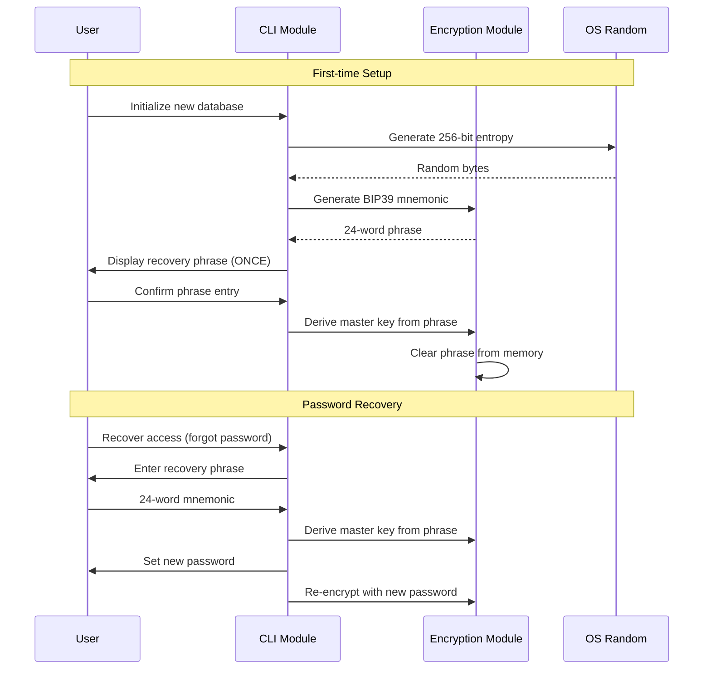
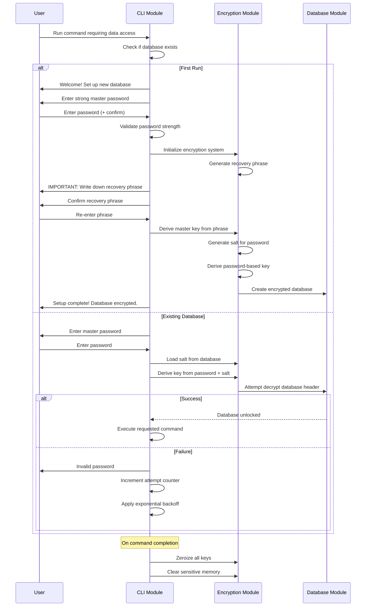
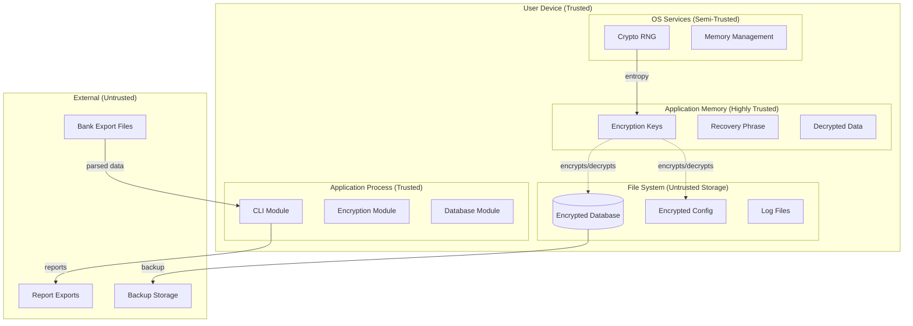

# Security Architecture: Privacy-First Personal Finance CLI

Version: 1
Date: 2024-12-28
Status: Draft
Architecture Version: 1

## Executive Summary

This security architecture implements defense-in-depth protection for a privacy-first personal finance CLI using AES-256-GCM encryption, Argon2id key derivation, and a crypto-wallet-style recovery system. All financial data is encrypted at rest with no plaintext ever touching disk storage.

## Security Principles

This design follows these principles:

1. **Defense in depth**: Multiple layers of protection
2. **Least privilege**: Minimum necessary access
3. **Fail secure**: Errors default to secure state
4. **Zero trust for data**: Assume storage medium is compromised
5. **Transparent security**: User understands what is protected and how

---

# Finance CLI Application

## Data Classification

| Data Type | Sensitivity | Storage Location | Protection |
|-----------|-------------|------------------|------------|
| Transactions | Critical | DuckDB | AES-256-GCM encrypted |
| Account numbers | Critical | DuckDB | AES-256-GCM encrypted |
| Categories | High | DuckDB | AES-256-GCM encrypted |
| Rules | High | JSON config | AES-256-GCM encrypted |
| Recovery phrase | Critical | Display once only | Never stored |
| Master key | Critical | Memory only | Zeroized on exit |
| User password | Critical | Never stored | Derived and discarded |
| Logs (sanitized) | Low | Files | Integrity protection only |

## Encryption Architecture

### Recommendation: AES-256-GCM with Argon2id Key Derivation

**Algorithm**: AES-256-GCM
**Rationale**: Industry standard with authenticated encryption, hardware acceleration on most platforms, proven security record, and excellent Rust ecosystem support.

**Alternatives Considered**:

| Option | Pros | Cons | Why Not Selected |
|--------|------|------|------------------|
| ChaCha20-Poly1305 | Fast on mobile, constant-time | Less hardware acceleration | AES-GCM has better platform support |
| AES-256-CBC + HMAC | Widely supported | Manual MAC verification, larger overhead | GCM provides integrated authentication |
| XSalsa20-Poly1305 | Large nonce space | Less standardized | AES-GCM is more mature |

### Encryption Scope

**Approach**: File-level encryption with per-file keys

**What is encrypted**:
- DuckDB database file (complete encryption)
- JSON configuration files (rules, preferences)
- Backup archives (full encryption)

**What is not encrypted**:
- Application binary
- Log files (sanitized, no sensitive data)
- Temporary files (none created with sensitive data)

### Key Derivation

**Recommendation**: Argon2id
**Rationale**: Memory-hard function resistant to GPU/ASIC attacks, tunable parameters, OWASP recommended, excellent resistance to side-channel attacks.

**Parameters**: Leave to developers/Staff Engineer Rust to tune based on:
- Target derivation time (recommend 1-3 seconds)
- Available memory on target systems (recommend 64-128 MB)
- Security margin requirements (OWASP minimum: m=64MB, t=3, p=4)

### Key Management

```
┌─────────────────────────────────────────────────────────────┐
│                     Key Derivation Flow                      │
├─────────────────────────────────────────────────────────────┤
│                                                              │
│  User Password                                               │
│        │                                                     │
│        ▼                                                     │
│  ┌─────────────┐                                            │
│  │   Argon2id  │◄─── Salt (stored with encrypted data)      │
│  └─────────────┘                                            │
│        │                                                     │
│        ▼                                                     │
│  Master Key (256-bit, in memory only)                       │
│        │                                                     │
│        ├──► Database Encryption Key (256-bit)               │
│        │                                                     │
│        ├──► Config Encryption Key (256-bit)                 │
│        │                                                     │
│        └──► Backup Encryption Key (256-bit)                 │
│                                                              │
│  On Application Exit:                                        │
│  - Zeroize all keys in memory                               │
│  - Verify zeroization completed                             │
│  - Clear all sensitive data structures                      │
│                                                              │
└─────────────────────────────────────────────────────────────┘
```

**Key Storage**:
- Keys exist in memory only during application runtime
- No keys written to disk ever
- No keyring/keychain dependency (portable across systems)
- Derived keys use HKDF-SHA256 for domain separation

**Key Rotation**:
- User can change password via dedicated command
- Requires current password verification
- Re-encrypts all data with new key
- Old key zeroized immediately after rotation
- Atomic operation (all or nothing)

## Recovery Strategy

### Recommendation: Recovery Phrase (BIP39 Compatible)

**Rationale**: Provides secure backup without storing keys, familiar to crypto users, enables data recovery if password forgotten, maintains zero-knowledge architecture.

```
Recovery Phrase Approach:

1. On first run, generate 256-bit entropy using OS CSPRNG
2. Encode as 24-word BIP39 mnemonic phrase
3. Display to user ONCE with clear warnings
4. Require user to confirm by entering phrase back
5. Derive master key from mnemonic using PBKDF2-SHA256
6. User can restore access with mnemonic if password forgotten

Security Properties:
- Mnemonic is cryptographically equivalent to master key
- User MUST secure mnemonic offline (paper, steel backup)
- Lost mnemonic + forgotten password = permanent data loss
- No backdoors or recovery mechanisms in application
```

**Recovery Flow**:


## Authentication Flow



### Lockout Policy

- After 5 failed attempts: 30-second delay
- After 10 failed attempts: 5-minute delay
- After 15 failed attempts: 30-minute delay
- No permanent lockout (user may have legitimate typos)
- Counter resets on successful authentication
- Delays apply per session, not persistent

### Session Management

- No persistent sessions (CLI is stateless by design)
- Key remains in memory during single command execution
- Key zeroized when command completes successfully
- Key zeroized immediately on any error condition
- Long-running commands: periodic memory clearing of intermediate data

---

## Security Controls Summary

| Control | Implementation | Rationale |
|---------|---------------|-----------|
| Encryption at rest | AES-256-GCM | Industry standard, authenticated |
| Key derivation | Argon2id | Memory-hard, ASIC-resistant |
| Memory zeroization | Required for all keys | Prevent memory dumps |
| Recovery system | BIP39 mnemonic | Secure, user-controlled backup |
| Authentication | Password + salt | Standard practice |
| Session handling | Stateless, immediate cleanup | Minimize exposure window |
| Error sanitization | No sensitive data in errors | Prevent information leakage |
| Audit logging | Sanitized events only | Compliance and debugging |

---

## Compliance Considerations

### Data Protection

- All financial data encrypted at rest with AES-256-GCM
- No cloud transmission (local-only operation)
- User controls all keys and recovery mechanisms
- Data deletion is cryptographically secure (encrypted data without key is unrecoverable)
- No key escrow or backdoors

### Privacy

- No telemetry or usage tracking
- No external network connections
- No data collection or transmission
- User has complete data sovereignty
- Open source for transparency and auditability

---

## Changelog

| Version | Date | Changes |
|---------|------|---------|
| 1 | 2024-12-28 | Initial security specification with AES-256-GCM and Argon2id |

---

# Threat Model: Privacy-First Personal Finance CLI

Version: 1
Date: 2024-12-28

## Scope

This threat model covers:
- Finance CLI Application
- Local data storage and encryption
- User authentication and key management
- Recovery system security
- Operational security considerations

## Assets

| Asset | Description | Value |
|-------|-------------|-------|
| Financial transactions | User's complete financial history | Critical |
| Account numbers | Bank and credit card account identifiers | Critical |
| Category/rule configuration | User's financial classification system | High |
| Encryption keys | Keys protecting all financial data | Critical |
| Recovery phrase | BIP39 mnemonic for key recovery | Critical |
| User password | Master password for database access | Critical |
| Application database | Encrypted DuckDB with all user data | Critical |

## Trust Boundaries



## Threat Analysis (STRIDE)

### Spoofing

#### T-SPOOF-01: Attacker impersonates user to access encrypted data

**Scenario**: Attacker gains physical access to device and attempts to access financial data without knowing the password.

**Likelihood**: Medium
**Impact**: Critical
**Risk Score**: High

**Mitigations**:
- AES-256-GCM encryption requires password-derived key
- Argon2id makes password cracking computationally expensive
- No stored passwords or authentication tokens
- OS-level device security (screen lock, full disk encryption)

**Residual Risk**: Low (attacker needs password AND recovery phrase for full access)

---

#### T-SPOOF-02: Malicious application mimics finance CLI

**Scenario**: Attacker creates fake version of CLI to capture user password and data.

**Likelihood**: Low
**Impact**: Critical
**Risk Score**: Medium

**Mitigations**:
- Code signing and integrity verification
- User education on downloading from official sources
- Open source code for community verification
- Consistent UI/UX patterns users can recognize

**Residual Risk**: Low (requires social engineering)

---

### Tampering

#### T-TAMP-01: Attacker modifies encrypted database file

**Scenario**: Attacker with file system access modifies encrypted database to cause corruption or inject malicious data.

**Likelihood**: Medium
**Impact**: High
**Risk Score**: High

**Mitigations**:
- AES-256-GCM provides authenticated encryption (tampering detected)
- Database integrity checks on open
- Application refuses to process corrupted data
- Backup and restore capabilities for recovery

**Residual Risk**: Very Low (tampering detected, data integrity preserved)

---

#### T-TAMP-02: Attacker modifies application binary

**Scenario**: Attacker replaces legitimate CLI binary with malicious version to steal credentials.

**Likelihood**: Low
**Impact**: Critical
**Risk Score**: Medium

**Mitigations**:
- Code signing verification
- Package manager integrity (checksums, signatures)
- File system permissions and access controls
- Regular security updates

**Residual Risk**: Low (requires elevated system access)

---

#### T-TAMP-03: Attacker modifies import files to inject malicious data

**Scenario**: Attacker modifies CSV/QFX files to inject malicious transaction data.

**Likelihood**: Medium
**Impact**: Medium
**Risk Score**: Medium

**Mitigations**:
- Strict input validation on all imported data
- Sanitization of transaction descriptions
- File format validation before processing
- User review of import preview before confirmation

**Residual Risk**: Low (validation prevents malicious data injection)

---

### Repudiation

#### T-REP-01: User denies making financial categorizations

**Scenario**: User claims they didn't categorize transactions or create specific rules.

**Likelihood**: Low
**Impact**: Low
**Risk Score**: Very Low

**Mitigations**:
- Audit log of all categorization changes with timestamps
- Rule creation and modification tracking
- User is sole operator (no multi-user disputes)
- Immutable log entries

**Residual Risk**: Very Low (single-user system with audit trail)

---

### Information Disclosure

#### T-DISC-01: Encryption keys extracted from memory

**Scenario**: Sophisticated malware or memory dump analysis exposes encryption keys while application is running.

**Likelihood**: Low
**Impact**: Critical
**Risk Score**: High

**Mitigations**:
- Minimize key lifetime in memory (only during active operations)
- Zeroize keys immediately after use with secure memory functions
- Use memory protection where available (mlock, VirtualLock)
- OS-level malware protection and endpoint security

**Residual Risk**: Medium (sophisticated malware could still extract during active use)

---

#### T-DISC-02: