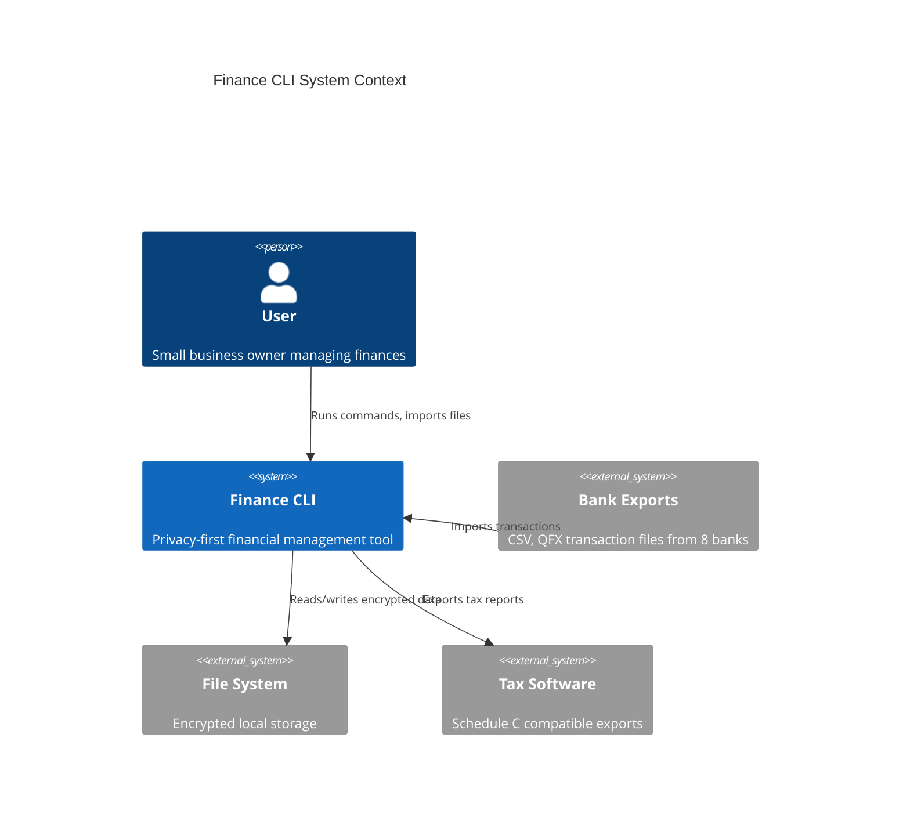
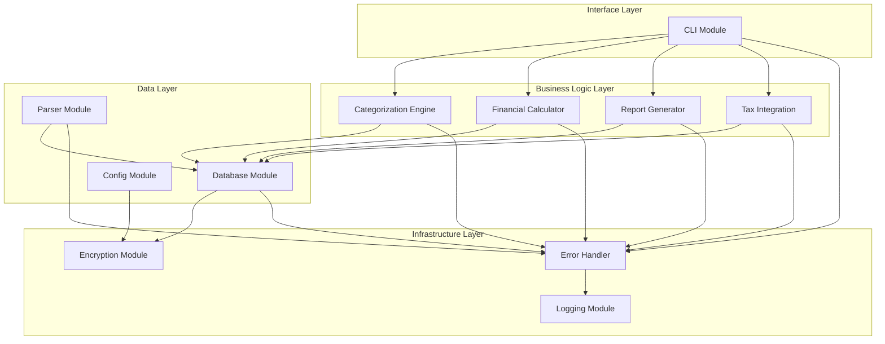
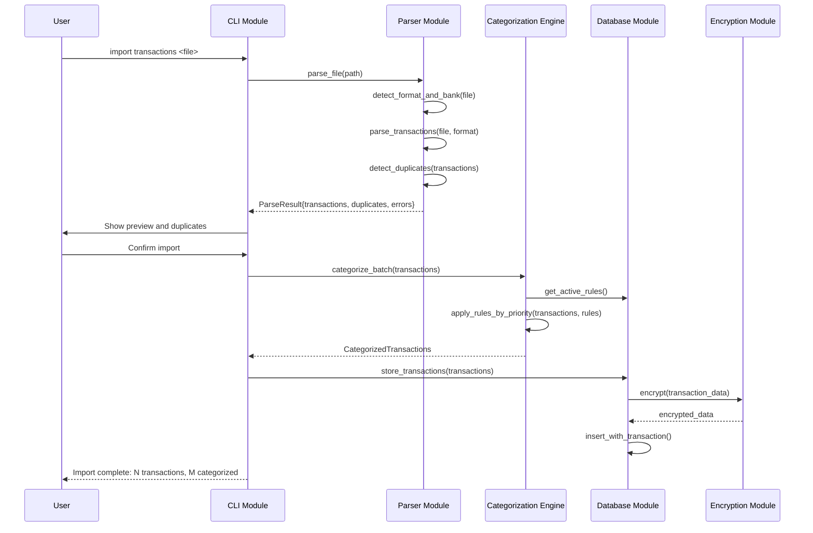
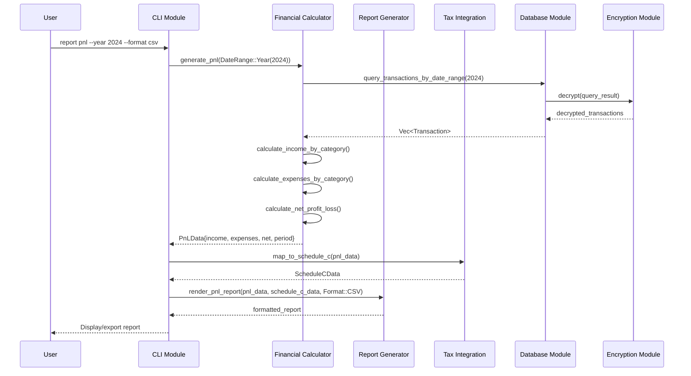
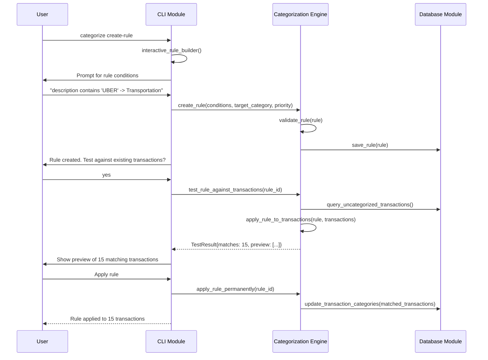

# System Architecture: Privacy-First Personal Finance CLI

Version: 1
Date: 2024-12-28
Status: Draft
Requirements Version: 1
Roadmap Version: 1

## Executive Summary

This architecture implements a privacy-first personal finance CLI using a layered, modular design that prioritizes data security, offline operation, and maintainability. The system uses Rust for memory safety and performance, DuckDB for local SQL capabilities, and AES-256-GCM for data encryption.

## Systems Overview

This architecture covers one primary system:

1. **Finance CLI Application**: Privacy-first personal finance management tool for freelancers and small business owners

---

# Finance CLI Application

## System Context

## Component Architecture

## Module Descriptions

### Interface Layer

#### CLI Module

**Responsibility**: Handle user commands, parse arguments, format output, manage interactive workflows

**Public Interface**:
- Command parser with subcommands (import, categorize, report, edit, backup)
- Output formatter with colored text and progress indicators
- Interactive prompts for complex operations
- Help system and usage examples
- Error display and user guidance

**Dependencies**: All Business Logic modules, Error Handler

**Implementation Notes**:
- Uses clap for argument parsing
- Supports both batch and interactive modes
- Progress bars for long operations
- Tab completion where possible

---

### Business Logic Layer

#### Categorization Engine

**Responsibility**: Apply user-defined rules to categorize transactions automatically and manually

**Public Interface**:
- Create, update, delete categorization rules
- Test rules against transactions without applying
- Apply rules to transactions in priority order
- Manual categorization override
- Rule effectiveness tracking
- Bulk recategorization operations

**Dependencies**: Database Module, Error Handler

**Rule Types**:
- Text contains/exact match on description
- Amount range matching
- Merchant name patterns
- Date range conditions
- Account type filters
- Compound rules with AND/OR logic

---

#### Financial Calculator

**Responsibility**: Compute financial statements, metrics, and business calculations

**Public Interface**:
- Generate Profit & Loss statements
- Generate Cash Flow reports
- Calculate business income by category
- Calculate business expenses by category
- Compute net profit/loss for periods
- Handle multiple account aggregation
- Period-over-period comparisons

**Dependencies**: Database Module, Error Handler

**Calculation Types**:
- Income aggregation by category and time period
- Expense aggregation by category and time period
- Net cash flow calculations
- Monthly, quarterly, yearly breakdowns
- Beginning/ending balance reconciliation

---

#### Report Generator

**Responsibility**: Format financial data into user-readable reports with multiple export options

**Public Interface**:
- Render P&L reports (console, CSV, formatted text)
- Render Cash Flow reports (console, CSV, formatted text)
- Generate summary reports
- Custom date range reporting
- Transaction detail reports
- Category breakdown reports

**Dependencies**: Financial Calculator, Database Module, Error Handler

**Export Formats**:
- Console display with colored formatting
- CSV for spreadsheet import
- Formatted text for printing
- JSON for programmatic access

---

#### Tax Integration

**Responsibility**: Map business transactions to IRS Schedule C line items and generate tax-ready reports

**Public Interface**:
- Map expense categories to Schedule C lines
- Generate Schedule C summary reports
- Validate mappings against current tax forms
- Export tax data in compatible formats
- Handle tax year boundaries
- Support custom mapping modifications

**Dependencies**: Financial Calculator, Database Module, Error Handler

**Schedule C Line Items**:
- Standard business expense categories
- Line-by-line totals calculation
- Tax software compatible exports
- Annual tax form updates support

---

### Data Layer

#### Parser Module

**Responsibility**: Parse transaction files from multiple banks and formats with robust error handling

**Public Interface**:
- Auto-detect file format (CSV, QFX)
- Auto-detect bank/institution
- Parse transactions with validation
- Handle malformed files gracefully
- Duplicate transaction detection
- Batch file processing

**Dependencies**: Error Handler

**Supported Banks**:
- Chase: Custom CSV format
- Wealthfront: Custom CSV format  
- Bank of America: Custom CSV format
- Ally: Custom CSV format
- AMEX: Custom CSV format
- Discover: Custom CSV format
- Citi Bank: Custom CSV format
- Capital One: Custom CSV format
- Generic QFX: Standard OFX format

**Duplicate Detection**:
- Hash-based on date + amount + description
- Configurable tolerance for amount variations
- User confirmation for potential duplicates

---

#### Database Module

**Responsibility**: Manage encrypted DuckDB database with transactions, rules, and configuration

**Public Interface**:
- Initialize and connect to encrypted database
- Store and retrieve transactions
- Manage categorization rules
- Handle database migrations
- Backup and restore operations
- Query optimization for reports

**Dependencies**: Encryption Module, Error Handler

**Data Models**:
- Transactions: id, date, amount, description, category, account, raw_category, hash
- Categories: id, name, schedule_c_line, parent_id
- Rules: id, priority, conditions, target_category, effectiveness_count
- Accounts: id, name, bank, account_type
- User Preferences: settings, default categories, report preferences

**Migration System**:
- Version-controlled schema changes
- Backwards compatibility checks
- Data integrity validation
- Rollback capability

---

#### Config Module

**Responsibility**: Manage user configuration, preferences, and application settings

**Public Interface**:
- Load and save user preferences
- Manage default categories
- Store report preferences
- Handle CLI configuration
- Validate configuration integrity
- Support configuration migration

**Dependencies**: Encryption Module, Error Handler

**Configuration Areas**:
- Default transaction categories
- Report formatting preferences
- CLI behavior settings
- Bank-specific parsing options
- Backup preferences
- Security settings

---

### Infrastructure Layer

#### Encryption Module

**Responsibility**: Provide AES-256-GCM encryption with secure key management and recovery system

**Public Interface**:
- Encrypt/decrypt data with authenticated encryption
- Derive keys from master password using PBKDF2
- Generate and validate recovery codes
- Secure memory handling and cleanup
- Key rotation support
- Password strength validation

**Dependencies**: None (standalone)

**Security Features**:
- AES-256-GCM for authenticated encryption
- PBKDF2 with 100,000+ iterations for key derivation
- Cryptographically secure random recovery codes
- Memory zeroing after use
- Salt generation and management
- Constant-time comparisons

**Note**: Security Architect will refine implementation details including specific parameters, library choices, and threat mitigations.

---

#### Logging Module

**Responsibility**: Provide structured logging for debugging, auditing, and monitoring

**Public Interface**:
- Log events with configurable levels
- Structured logging with context
- Log rotation and archival
- Performance metrics logging
- Security event logging
- Query logs for debugging

**Dependencies**: None (standalone)

**Log Levels**:
- ERROR: Application errors and failures
- WARN: Recoverable issues and warnings
- INFO: General application events
- DEBUG: Detailed debugging information
- TRACE: Verbose execution tracing

**Security Considerations**:
- No sensitive data in logs
- Log file encryption for sensitive events
- Configurable log retention

---

#### Error Handler

**Responsibility**: Centralized error handling, user-friendly error messages, and recovery guidance

**Public Interface**:
- Handle and categorize errors
- Generate user-friendly error messages
- Provide recovery suggestions
- Log errors appropriately
- Support error reporting
- Graceful degradation

**Dependencies**: Logging Module

**Error Categories**:
- User Input Errors: Clear guidance for correction
- File System Errors: Permission, space, corruption issues
- Database Errors: Connection, query, integrity problems
- Encryption Errors: Key, password, corruption issues
- Parser Errors: File format, encoding, validation problems
- Network Errors: N/A (offline-only application)

---

## Data Flow

### Transaction Import Flow

### Report Generation Flow

### Rule-Based Categorization Flow

## Integration Points

### File System Integration

| Interface | Direction | Format | Description |
|-----------|-----------|--------|-------------|
| Transaction Import | Inbound | CSV, QFX | Raw bank exports from 8 supported institutions |
| Database Storage | Bidirectional | Encrypted DuckDB | All persistent data storage |
| Config Storage | Bidirectional | Encrypted JSON | User settings and preferences |
| Report Export | Outbound | CSV, Text, JSON | Generated financial and tax reports |
| Backup Files | Bidirectional | Encrypted Archive | Database and config backups |
| Log Files | Outbound | Text | Application logs and audit trails |

### Encryption Integration

| Component | Data Encrypted | Key Derivation | Recovery Method |
|-----------|----------------|----------------|-----------------|
| Database | All tables | Master password + PBKDF2 | Recovery code |
| Config | Settings, rules | Master password + PBKDF2 | Recovery code |
| Backups | Full archive | Master password + PBKDF2 | Recovery code |
| Logs | Sensitive events only | Master password + PBKDF2 | Recovery code |

## Technology Stack Validation

### Core Technologies

| Component | Technology | Justification | Risks |
|-----------|------------|---------------|-------|
| Language | Rust | Memory safety, performance, single binary | Learning curve, compile times |
| Database | DuckDB | Local SQL, no server, good performance | Encryption integration complexity |
| CLI Framework | clap | Rich features, good ergonomics | None significant |
| Encryption | AES-256-GCM | Industry standard, authenticated | Key management complexity |
| Key Derivation | PBKDF2 | Proven, configurable iterations | Argon2 might be better but less mature in Rust |

### Key Rust Crates

| Crate | Purpose | Alternatives Considered |
|-------|---------|------------------------|
| clap | CLI argument parsing | structopt (deprecated), argh |
| duckdb | Database integration | rusqlite (less features), sled (no SQL) |
| aes-gcm | Authenticated encryption | chacha20poly1305 (similar security) |
| pbkdf2 | Key derivation | argon2 (newer but less ecosystem support) |
| serde | Serialization | Manual parsing (more error-prone) |
| tokio | Async runtime (if needed) | async-std, smol |
| csv | CSV parsing | Manual parsing (error-prone) |
| chrono | Date/time handling | time crate (less features) |

### Architecture Validation

**Strengths**:
- Clear separation of concerns with layered architecture
- Modular design enables parallel development
- Strong encryption and privacy guarantees
- Comprehensive error handling strategy
- Scalable rule-based categorization system

**Potential Issues**:
- DuckDB encryption integration may require custom solutions
- Large file parsing may need streaming approach
- Rule engine performance with complex rules needs validation
- Recovery code UX complexity

**Mitigations**:
- Prototype DuckDB encryption early (Sprint S1-08)
- Implement streaming parser for large files
- Performance testing with realistic data volumes
- User testing of recovery code workflow

---

# Gaps for Specialist Architects

## For Data Architect

**Database Schema Design**:
- Detailed table structures with proper indexes
- Relationship design between transactions, categories, rules
- Query optimization for report generation
- Data normalization vs. denormalization trade-offs
- Migration strategy for schema evolution

**Specific Areas**